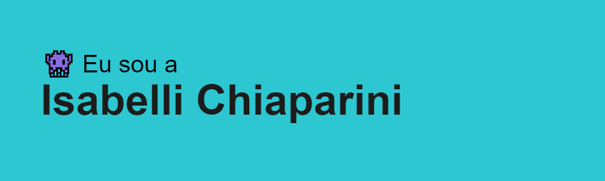

###  Um pouquinho sobre mim 👇
```javascript
const anmol = {
    pronomes: "Ela" | "Dela",
    cursando: ["Análise de Desenvolvimento de Sistemas no SENAI ITÁLO BOLOGNA"],
    tecnologias: ["Javascript", "Python", "PHP", "Flutterflow", "Mindstorm EV3", "Microbit"],
    banco de dados: ["MySQL", "Supabase"],
    cursos complementares: {
            CyberLeader: "60h de proficiência na utilização do Microsoft Office 365",
        }
};
```
<br>

### 🖥️ My DevSetup
       


<br>
<h2>Contatos 💻</h2>


 

    
